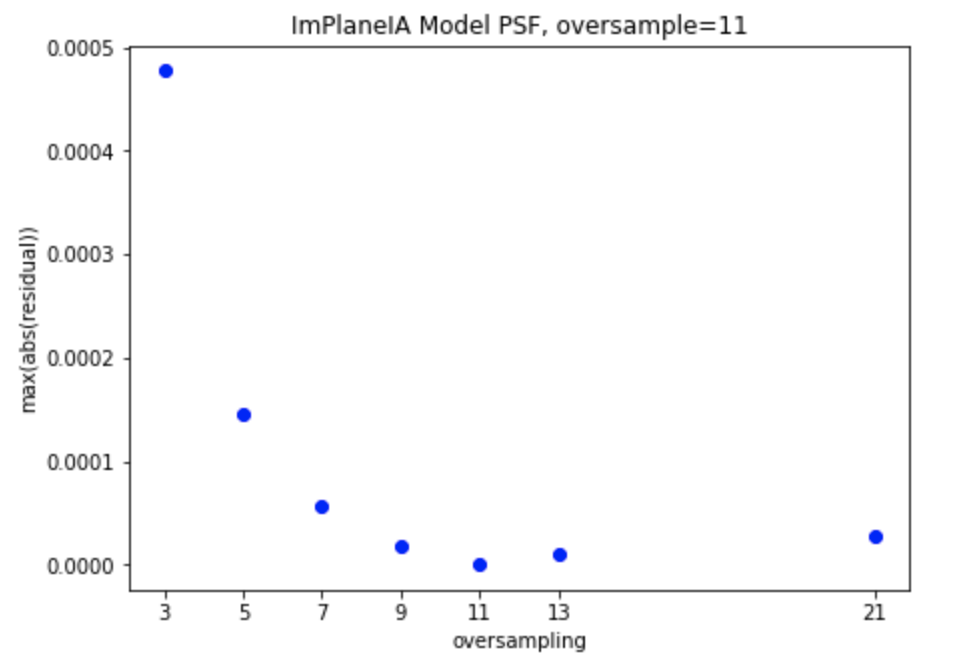
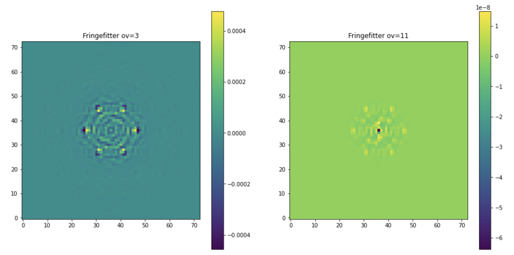
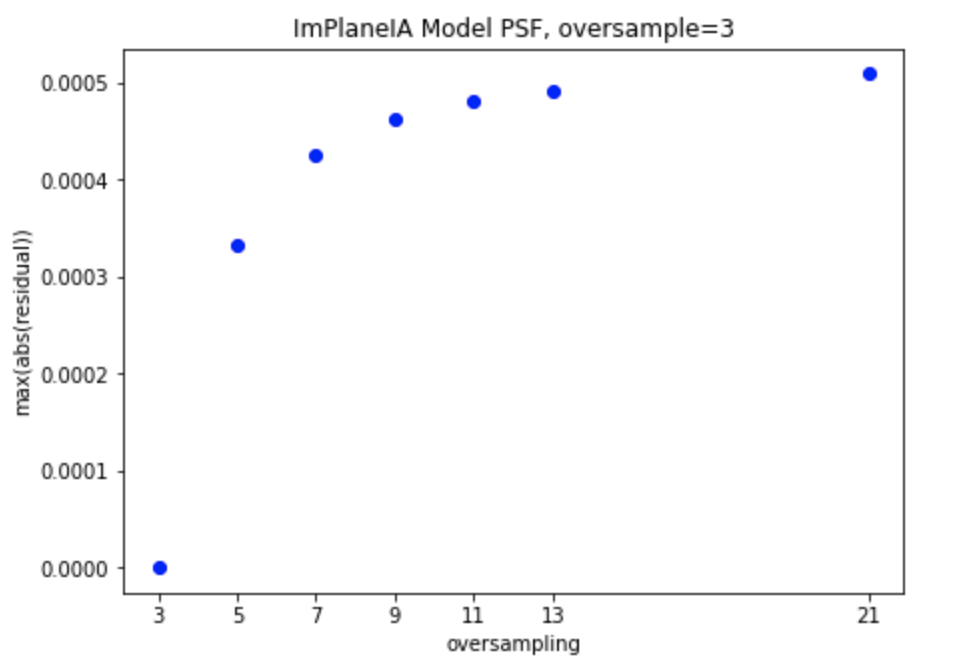
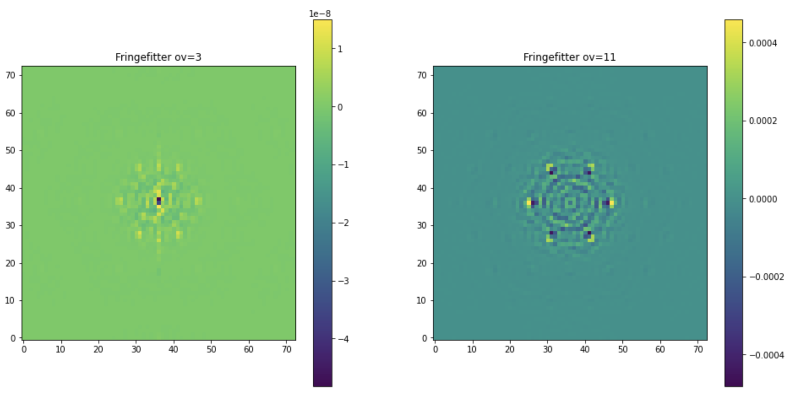

# Oversampling Tests
Rachel Cooper
03/30/2022


We find that fringe fitting residual of simulated data is highly dependent on the oversampling factor at which the PSF was originally generated and the oversampling chosen for the fitting model. To illustrate this, we used a monochromatic PSF generated with the `NRM_Model` class at 11x oversampling, i.e.:

```python
from nrm_analysis.fringefitting.LG_Model import NRM_Model

jw = NRM_Model(mask='jwst_g7s6c',holeshape="hex")
jw.set_pixelscale(pixelscale_rad)
jw.simulate(fov=81,
    bandpass=np.array([1.0, 3.8e-6]),
    over=11)
```

and analyzed with ImPlaneIA:

```python
from nrm_analysis import nrm_core, InstrumentData

niriss = InstrumentData.NIRISS("F380M", bandpass=np.array([1.0, 3.8e-6]), usebp=False)
ff = nrm_core.FringeFitter(niriss, 
                             oitdir=oitdir,
                             oifdir=oifdir,
                             oversample=11,
                             interactive=False,
                             save_txt_only=False,
                             weighted=False)

ff.fit_fringes(psf_file)
```

displays the following maximum residual (data - model) when fringe fitting is performed at a range of oversampling factors:



The maximum residual from extraction oversampling=11 is several orders of magnitude smaller than the next-smallest max residual. The location of the max residual also differs; when the oversampling at which the PSF was generated is matched in fringe fitting, the maximum residual is at the PSF center, but when it does not match, the maximum residual is seen at the "snowflake points."
The difference in the residual for the 11x-oversampled PSF analyzed with 3 vs. 11 oversampling in fringe fitting is easy to see:



We repeated this exercise by generating a PSF simulated at 3x oversampling and anlyzing it with a range of fringe fitter oversampling factors, and can confirm that the critical point here is to _match_ the fringe fitter oversampling to the simulation oversampling:



It is clear that the best (smallest) maximum residual occurs for the PSF generated at ov=3 and analyzed with ov=3. The same effect with the location of the max residual is seen here as well:




The apparent limit of \~1e-8 maximum residual is due to the "nudge" of the PSF location by 1e-8 to avoid singularities. During actual science, there will of course not be an oversampling factor at which the data was created. For most cases, a residual of 1e-4 will be perfectly sufficient. 


**Note:** The PSFs were generated at a hardcoded pixel scale of 65.6 mas/px. When a MAST-style header from a MIRAGE simulation is grafted onto the PSF file to make it "digestible" with `utils.amisim2mirage`, it gains CD matrix keywords that ImPlaneIA uses to find the X and Y pixel scales which are then averaged and used for fringe fitting. The difference between that average pixel scale and the hardcoded one is small but has a significant effect on the residual image, so we "force" ImPLaneIA to use the same pixel scale as the PSF was generated at by removing the CD keywords from the "mirage-ized" file.


